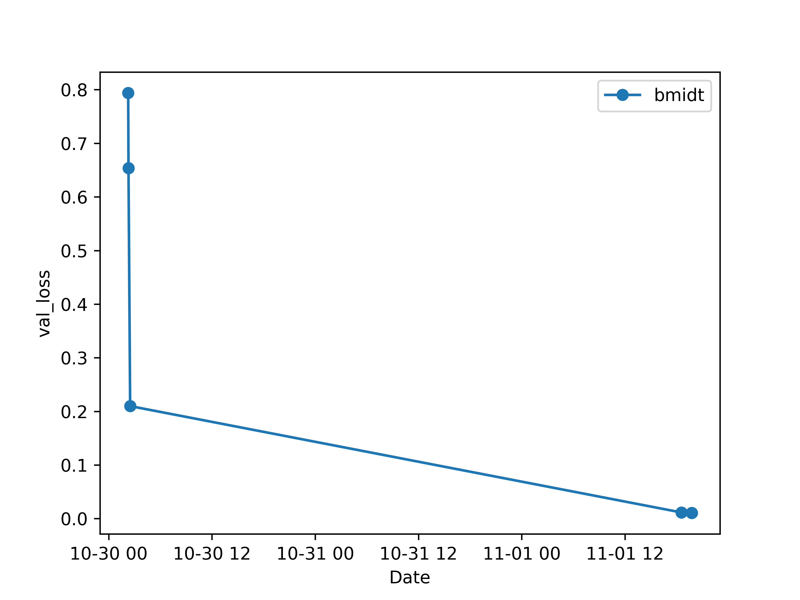

# ApidChallenge

We will win!

## Todo

### Visualization
- [ ] Tool to see what variables have largest impact on score
  - [ ] LDA / QDA?
  - [ ] Plotting results on push
  - [ ] Plotting results on demand
- [ ] TensorBoard?
- [ ] Compare training / validation results
- [ ] Evaluate model on validation and save results

### Testing
- [ ] Constant validation / training split
- [ ] Implement metrics
  - [ ] Choose metric weights

### Tests
- [ ] Model depth
- [ ] Model breadth
- [ ] Regularization
- [ ] Gan-loss vs metric weighting
- [ ] Normalization
- [ ] Augmentation
- [ ] Batch size
- [ ] Crop size
- [ ] Discriminator type
  - [ ] Patch
  - [ ] U-Net
  - [ ] Standard?
- [ ] Steps per pooling
- [ ] Inception layers?

### Generator
- [ ] Feature that just loads an input/output pair
- [ ] Feature that augments

### Scripting
- [ ] Allow run_and_evaluate.py script.py -i $index syntax
- [ ] Automated queueing of scripts on cluster
- [ ] Automated commit / push of cluster results on completion

## Leaderboard

